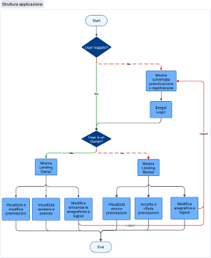

# ServiFino

## Gestione degli utenti
La logica alla base del sistema è determinata da un campo booleano, `isOwner`, all’interno della collection `users`. Il campo distingue in modo semplice ed efficace i gestori (Owner) dai lavoratori (Worker), garantendo che ciascun utente possa accedere solo alle funzionalità pensate per il proprio ruolo.

## Struttura applicazione

Un breve grafico che rappresenta l'albero dei componenti.

